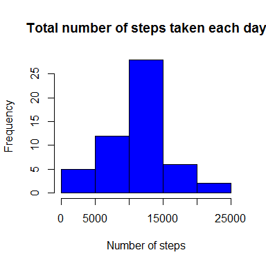
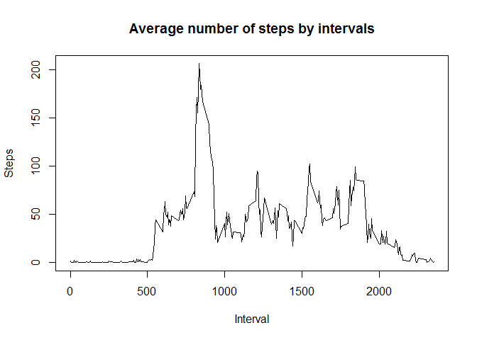
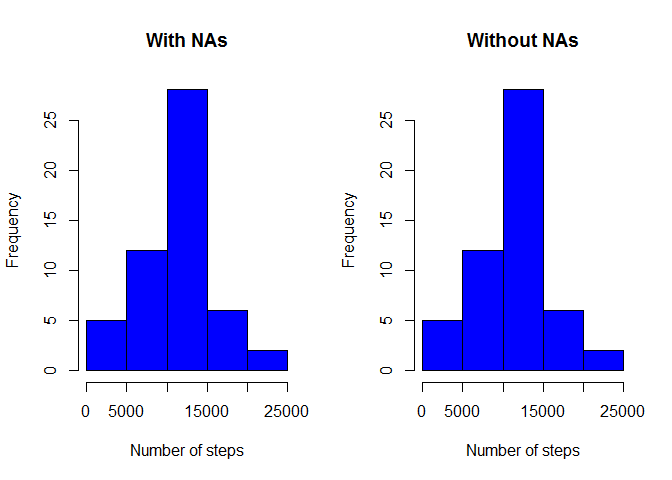
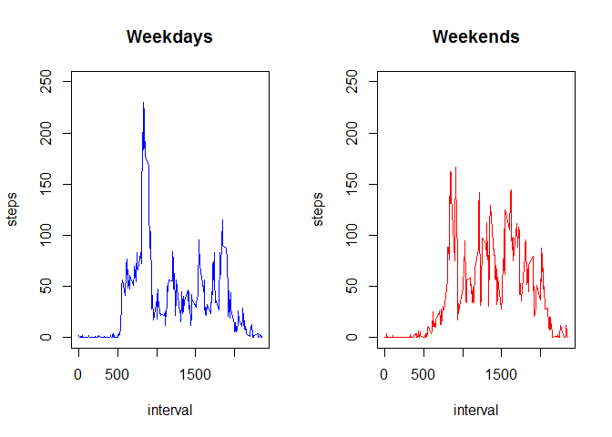

Reproducible Research: Peer Assessment 1
========================================

Loading and preprocessing the data
----------------------------------

File
[activity.zip](https://github.com/ua-umka/RepData_PeerAssessment1/blob/master/activity.zip?raw=true)
are downloaded and uncompressed in a working directory. To uncompress
the file *downloader package* is used.

    library("downloader")
    if (!file.exists("activity.zip")) {
          url <- "https://github.com/ua-umka/RepData_PeerAssessment1/blob/master/activity.zip?raw=true"
          download(url, dest="activity.zip", mode="wb")
          unzip ("activity.zip")
    }
    data <- read.csv("activity.csv")

The data is processed into a format suitable for the analysis by summing
up steps for each day. The histogram below shows the result.

    day <- aggregate(steps ~ date, data = data, FUN = sum)
    hist(day$steps, main = "Total number of steps taken each day",
         xlab = "Number of steps", col = "blue")

What is mean and median total number of steps taken per day?
------------------------------------------------------------

    mean(day$steps)

    ## [1] 10766.19

    median(day$steps)

    ## [1] 10765

What is the average daily activity pattern?
-------------------------------------------

To address this question, a time series plot is drawn. X-axis represents
the 5-minute interval, while y-axis - the average number of steps taken
during those intervals.

    interv <- aggregate(steps ~ interval, data = data, mean)
    plot(interv$interval, interv$steps, type = "l", xlab = "Interval", ylab = "Steps", main = "Average number of steps by intervals")

<!-- -->

**Which 5-minute interval, on average across all the days in the
dataset, contains the maximum number of steps?**

Imputing missing values
-----------------------

First, we'll calculate the total number of rows with at least one
missing value in it.

    table(complete.cases(data[[1]], data[[2]], data[[3]]))[[1]]

    ## [1] 2304

Let's check how many NAs are in the steps column.

    sum(is.na(data$steps))

    ## [1] 2304

The same number, so all NAs are in the step column.

#### Filling in the NAs

The strategy for filling in the missing values in the dataset will be to
fill them whith the mean for an appropriate 5-minute interval calculated
before.

Let's create a new dataset that is equal to the original dataset but
with the missing data filled in.

    dataWhNa <- data
    row <- which(is.na(data))
    for (i in row) {
          dataWhNa[i,1] <- interv[interv$interval == dataWhNa[i,3], 2]
    }

Let's check the difference between the old one and the new one without
NAs by drawing them side by side.

    par(mfrow = c(1,2))
    hist(day$steps, main = "With NAs",
         xlab = "Number of steps", col = "blue")
    dayWhNas <- aggregate(steps ~ date, data = dataWhNa, FUN = sum)
    hist(day$steps, main = "Without NAs",
         xlab = "Number of steps", col = "blue")

<!-- -->

Doesn't see any difference. How about mean and median of the total
number of steps taken per day?

    mean(dayWhNas$steps); median(dayWhNas$steps)

    ## [1] 10766.19

    ## [1] 10766.19

    # The difference:
    mean(dayWhNas$steps) - mean(day$steps); median(day$steps) - median(dayWhNas$steps)

    ## [1] 0

    ## [1] -1.188679

So there is a slight change in median. The median of the data without
NAs is higher by 1.19 step per day.

Are there differences in activity patterns between weekdays and weekends?
-------------------------------------------------------------------------

Let's create a new factor variable in the dataset with two levels
Weekend and Weekday.

    weekday <- character()
    for (i in 1:(dim(dataWhNa)[1])) {
          weekday[i] <-  weekdays(as.Date(dataWhNa$date[i]))
    }
    weekday[weekday %in% c("Saturday", "Sunday")] <- "Weekend"
    weekday[weekday != "Weekend"] <- "Weekday"
    dataWhNa <- cbind(dataWhNa, weekday)
    weekDays <- dataWhNa[dataWhNa$weekday == "Weekday",]
    weekEnds <- dataWhNa[dataWhNa$weekday == "Weekend",]

Now when we have the factor in the data, let's look at the plots of the
average number of steps separately for weekdays and weekends.

    weekDays <- aggregate(steps ~ interval, data = weekDays, mean)
    weekEnds <- aggregate(steps ~ interval, data = weekEnds, mean)
    par(mfrow = c(1,2))
    plot(weekDays, type = "l", main = "Weekdays", ylim = c(0,250), col = "blue")
    plot(weekEnds, type = "l", main = "Weekends", ylim = c(0,250), col = "red")

<!-- -->

They definitely differs. We don't see such a big step spikes during
weekends as we see for Weekdays, but overall the are more steps during
weekends than weekdays.
